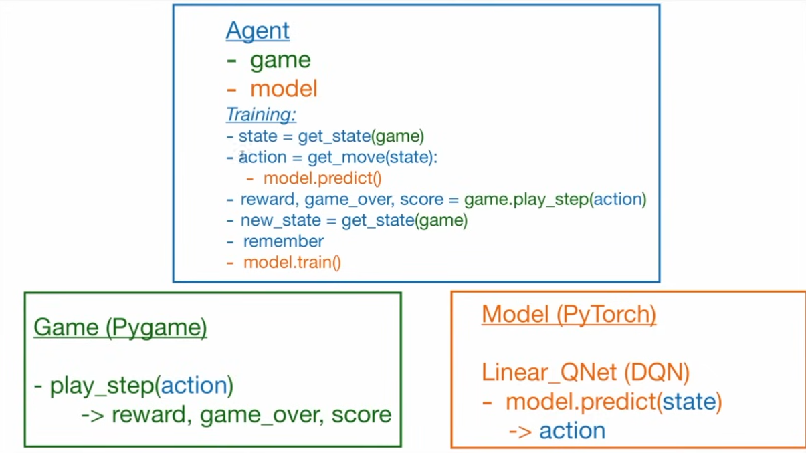

# Reinforcement Learning Agent for Pygame Environment

This project implements a Reinforcement Learning agent using PyTorch to play a game developed with Pygame. The agent learns to play the game through interaction and updates its policy based on the rewards it receives.

## Project Overview

The project consists of three main components:

1.  **Game (Pygame):** The environment in which the agent interacts.
2.  **Agent:** The learning entity that makes decisions and interacts with the game.
3.  **Model (PyTorch):** The neural network that represents the agent's policy.



## Components

### 1. Game (Pygame)

-   The game environment is built using Pygame.
-   It provides the `play_step(action)` method, which takes an action from the agent and returns the new state, reward, game over status, and score.

    ```python
    # Example snippet (conceptual)
    def play_step(action):
        # ... game logic ...
        reward = ...
        game_over = ...
        score = ...
        return reward, game_over, score
    ```

### 2. Agent

-   The agent interacts with the game and learns to make optimal decisions.
-   It uses a neural network model to predict the best action for a given state.
-   The training loop involves the following steps:

    1.  **Get State:** Retrieve the current state of the game using `get_state(game)`.
    2.  **Choose Action:** Select an action based on the model's prediction using `get_move(state)`.
        -   The model predicts the Q-values for each possible action using `model.predict(state)`.
    3.  **Play Step:** Execute the chosen action in the game using `game.play_step(action)`.
    4.  **Receive Feedback:** Obtain the reward, game over status, and score from the game.
    5.  **Get New State:** Retrieve the new state of the game using `get_state(game)`.
    6.  **Remember:** Store the experience (state, action, reward, new state) in a replay buffer.
    7.  **Train Model:** Update the model's weights using the experiences from the replay buffer.

    ```python
    # Example snippet (conceptual)
    state = get_state(game)
    action = get_move(state)
    reward, game_over, score = game.play_step(action)
    new_state = get_state(game)
    remember(state, action, reward, new_state, game_over)
    model.train()
    ```

### 3. Model (PyTorch)

-   The model is implemented using PyTorch.
-   It uses a `Linear_QNet` (Deep Q-Network) to approximate the Q-values for each action.
-   The `model.predict(state)` method takes the current state as input and returns the predicted Q-values.

    ```python
    # Example snippet (conceptual)
    class Linear_QNet(nn.Module):
        def __init__(self, input_size, hidden_size, output_size):
            # ... model definition ...

        def forward(self, x):
            # ... forward pass ...

    model = Linear_QNet(input_size, hidden_size, output_size)

    def predict(state):
        # ... predict Q-values ...
        return action
    ```

## How to Run

1.  **Install Dependencies:**
    ```bash
    pip install pygame torch numpy
    ```
2.  **Clone the Repository:**
    ```bash
    git clone [repository_link]
    cd [repository_directory]
    ```
3.  **Run the Game:**
    ```bash
    python main.py
    ```

    (Replace `main.py` with the actual name of your main script)

## Project Structure